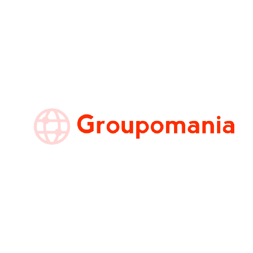

# Build-API: Create a social network for the Groupomania company

## Prerequis

- You need to install Node and npm locally on your computer.

## Installation

### part backend

- Clone https://github.com/isfiaya/Build-API-for-social-network-.git
- Run npm install
- Run npm start

### part frontend

- Clone https://github.com/isfiaya/FrontEnd-for-social-network.git
- Run npm install
- Run npm run serve

## I used

- Bootstrap
- javascript framework vuejs
- sass
- vuelidate to verfiy the form login and signup
- sweetalert2 : REPLACEMENT FOR JAVASCRIPT'S POPUP BOXES

## about database

- i used mysql database
